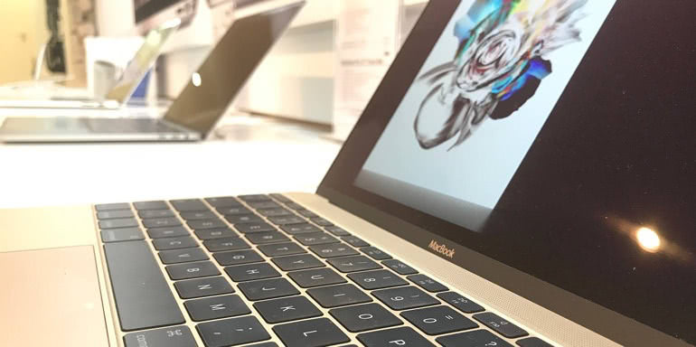

Title: Serving responsive and optimized images in a Pelican static website 
Date: 2018-04-21 00:35
Lang: en
Tags: python, pelican, static website, static website generator, images, optimization, responsive, html, jinja2, plugins, Pythonista, web development
Category: Programming
Slug: responsive_images_in_pelican
Author: Victor Domingos
Cover: images/avatars/x300/avatar4.png
Summary: Making this website load fast while looking good is one of my goals. But making sure that high resolution images don't weight more that necessary is not that easy, especially when you're writing your content on iOS and in Markdown...


## The problem
Well, in fact there are two separate problems here: 

1. automating the image resizing and optimization process;
2. serving the correct image size for each device.

Let's talk about each one separately...

## Automatic image resizing and optimization in Pelican

Using the [pelican-advthumbnailer](https://github.com/AlexJF/pelican-advthumbnailer){:target="_blank"} plugin, by Alexandre Fonseca, it's pretty easy to generate thumbnails inside Jinja2 templates that belong to the theme being used here. This is the line that generates the thumbnails for the blog index page:

````html+jinja

````

However, when we are writing content in Markdown, for use in a page or in a blog post, the plugin does not work as expected. Of course, you could switch entirely to HTML, but that would just make it harder to read and edit the text. The whole idea of a system like this, at least for me, is to abstract the content from the code, as much as possible. So, you must insert some HTML inside the Markdown. Here is how I made it work in one of my recently edited pages, where I had the need to insert a thumbnail:


```html

```

So, now we have automatically generated thumbnails, but unfortunately the new image files are not optimized for web. If we were exclusively on a desktop environment, we could add some image optimization utilities to our build script, just before the upload process. There are plenty of those utilities. But I am trying to keep the workflow compatible with Pythonista on iOS, so that I can either use my Mac, my iPhone or my iPad to update this website anytime. Unfortunately, with the current App Store restrictions, Python development on iOS has some important limitations. We can't just load some binaries, or binary based Python packages. We must use the packages included by the Pythonista developer, or a pure-Python package that does not depend on non-pure-python stuff.

I couldn't find any satisfactory solution for optimizing the thumbnails during the build process without breaking compatibility with iOS. All existing image optimization plugins I could find for Pelican depended on packages or external utilities that could not be used within Pythonista. Reading through the code of `pelican-advthumbnailer`, that is based on PIL, I found out that the images were being saved without any further optimization after the resizing process. Adding a few parameters could help us save a few kilobytes:


```python
            image = Image.open(original_path)
            thumbnail = self._resize(image, thumbnail_info.group("spec"))
            
            ### Trying to generate a smaller file here...
            # thumbnail.save(path)
            try:
                thumbnail.save(path, quality=70, optimize=True, progressive=True)
            except IOError:
                PIL.ImageFile.MAXBLOCK = image.size[0] * image.size[1]
                image.save(path, quality=70, optimize=True, progressive=True)
            ### End of my changes
            
            logger.info("Generated Thumbnail {}".format(os.path.basename(path)))
```

Following the advice found somewhere on the web or in PIL's documentation, I commented out the `thumbnail.save(path)` line and expanded it to optimize, reduce the quality to 70% and generate progressive JPEGs (if applicable). The changed plugin must now live in the projects' ` plugins` folder, instead of being just mentioned in the `Pipfile` or in the `requirements.txt` file. It's still not as good as having a proper image optimization routine, but better than just keeping uploading and serving completely non-optimized image files.


## Serving the correct image size for each device in Pelican


In the [Life]({filename}/pages/life.md) page, after fiddling with some different `<picture>` and `` tags, trying to make images responsive and perfectly adjusted to the screen size and resolution being used, I discovered that my current setup does not like the `<picture>` element. In this case, instead of using the plugin to generate each of the image sizes, I had to create them my self, because the plugin refused to recognize the multiple image URLs inside the `srcset` attribute. Not a big deal, as it was a one-time thing that I had to do for a specific page, and it had the advantage to allow me to further optimize the image files.

In the end, I came up with a halfway solution, that allows each browser to select from a source set of pictures in different sizes, allowing for 1x and 2x resolutions in most cases:


```html

```

Not perfect, but better than just serving an unnecessarily heavy "retina" image to non-"retina" devices, or a low resolution 1x image to high resolution devices.

In other places, like in the [Projects]({filename}/pages/projects/projects.md) page, I chose not to serve the thumbnails in different resolutions, as they were already pretty small. I decided to just use a 2x resolution thumbnail for all devices, in that situation. But I may change my mind one of these days...


## Have a better idea?
So, if you are also using Pelican and have come up with a better solution for these problems, please [let me know](https://victordomingos.com/contactos/). 
